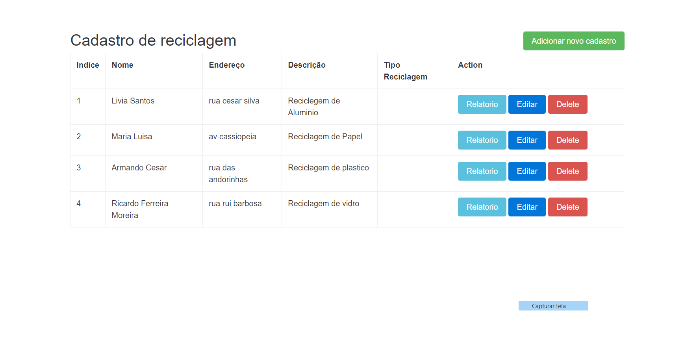

Sistema Rapido de cadastro de reciclagem

faça a importação do banco de dados que esta no repositório develo.sql

para rodar o sistema de o comando php artisan serve

use a url http://localhost:8000/recicle para ver o sistema

o sistema faz cadastro e faz a emissão de relatorio de reciclagem

feito com laravel,css,html5,bootstrap

